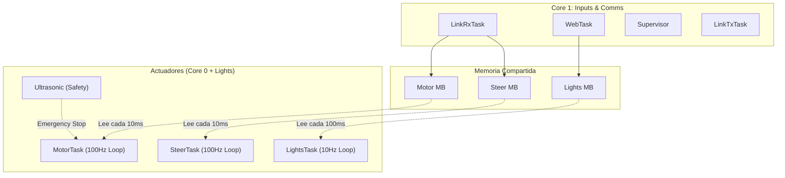

# Documento de Arquitectura de Software (SAD)

**Subsistema:** Low-Level Vehicle Controller (VCU)  
**Plataforma:** ESP32 / FreeRTOS  
**Versión:** 2.0.0 (Legacy Implementation - Polling Based)  
**Fecha:** Noviembre 2025  

---

## 1. Visión General de la Arquitectura

El sistema implementa una arquitectura de tiempo real basada en muestreo periódico (**Time-Triggered Architecture**). Las tareas de control se ejecutan a una frecuencia fija definida por `vTaskDelay`, consultando el estado de los mailboxes en cada ciclo.

Si bien utiliza la estructura de **Mailboxes** para el intercambio de datos thread-safe, el mecanismo de activación de tareas es sincrónico (basado en tiempo) y no asincrónico (basado en eventos).

### 1.1 Drivers Arquitectónicos (v2.0)
El diseño actual prioriza la simplicidad de implementación y la estabilidad del bucle de control periódico.

* **Ciclo de Control Fijo:** Las tareas de actuación (Motor/Dirección) corren a 100Hz (10ms) independientemente de la llegada de nuevos datos.
* **Seguridad (Safety):** Se implementa un mecanismo de `Time-To-Live` (TTL) en los datos para detener el vehículo ante pérdida de comunicaciones.
* **Separación de Núcleos:** Se utiliza *Core Pinning* para separar la lógica de red (Core 1) del control de motores (Core 0).

---

## 2. Estrategia de Comunicación Inter-Procesos (IPC)

La comunicación entre las tareas de recepción (`LinkRxTask`) y las de control (`MotorTask`) se realiza mediante un modelo de **Polling sobre Memoria Compartida**.

### 2.1 Mecanismo: Polling con Mailbox
A diferencia de un sistema puramente reactivo, aquí el consumidor es quien marca el ritmo.

1.  **Productor (LinkRx):** Escribe el dato en el `mailbox_t` protegido por Mutex tan pronto llega por UART.
2.  **Consumidor (MotorTask):**
    * Duerme durante un periodo fijo (`vTaskDelay(10ms)`).
    * Despierta.
    * Bloquea el Mutex y lee el Mailbox.
    * Si el dato es nuevo y válido, actualiza el PWM.
    * Vuelve a dormir.

### 2.2 Limitaciones de este Enfoque
* **Latencia Variable (Jitter):** Existe un retardo de entre 0ms y 10ms desde que el dato llega hasta que se procesa, dependiendo de en qué punto del ciclo de sueño se encuentre la tarea.
* **Consumo de CPU:** Las tareas despiertan 100 veces por segundo incluso si el vehículo está detenido y no hay comandos nuevos.

---

## 3. Vista Lógica y Estructura de Datos

### 3.1 Estructura del Mailbox
Se mantiene la estructura robusta que permite validar la frescura de los datos.

```c
typedef struct {
    uint32_t ts_ms;          // Timestamp de recepción
    topic_t topic;           // Identificador (Motor, Steer)
    command_type_t cmd;      // Comando
    int32_t value;           // Valor PWM/Ángulo
    uint32_t ttl_ms;         // Vida útil del comando
    SemaphoreHandle_t mutex; // Protección de lectura/escritura
} mailbox_t;
```

---

## 4. Diagramas de Arquitectura (Comportamiento Actual)

### 4.1 Diagrama de Secuencia: Ciclo de Polling

Este diagrama muestra cómo la ejecución de la tarea del motor está **desacoplada temporalmente** de la llegada del dato. Observa cómo el dato puede esperar en el buzón hasta que termine el `Delay`.

```mermaid
sequenceDiagram
    autonumber
    participant UART
    participant Producer as LinkRxTask
    participant Data as Motor Mailbox
    participant Consumer as MotorTask

    Note over Consumer: Estado: BLOCKED (Delay 10ms)

    %% El dato llega mientras la tarea duerme
    UART->>Producer: Recibe "SET_SPEED: 200"
    Producer->>Data: Escribe {val: 200}
    Note right of Data: Dato actualizado<br/>(Esperando lectura)

    %% La tarea sigue durmiendo...
    Note over Consumer: ... (Tiempo muerto) ...

    %% Finalmente despierta por el Timer
    Note over Consumer: Fin vTaskDelay()
    
    rect rgb(40, 40, 50)
        note right of Consumer: Ciclo de Control (100Hz)
        Consumer->>Data: Lee Mailbox
        Data-->>Consumer: Retorna {val: 200}
        Consumer->>Consumer: Actualizar PWM
    end

    Note over Consumer: vTaskDelay(10ms)
    Note over Consumer: Vuelve a Dormir
```



### 4.2 Diagrama de Despliegue

La estructura física es idéntica a la v3.0, pero las líneas de "Notificación" no existen o no son efectivas en la lógica de control principal.



---

## 5. Deuda Técnica y Plan de Migración

Esta versión (2.0.0) es funcional y estable, pero presenta limitaciones para conducción autónoma de alta velocidad o competición.

### 5.1 Problemas Identificados
1.  **Latencia de Entrada:** El retraso de hasta 10ms introduce un desfase perceptible entre la visión (Brain) y la acción (Ruedas).
2.  **Desperdicio de Recursos:** El microcontrolador no entra en modos de bajo consumo efectivos porque despierta constantemente.
3.  **Sincronización:** No se aprovecha la capacidad del ESP32 para reaccionar a interrupciones de software.

### 5.2 Propuesta de Refactor (Hacia v3.0.0)
Se ha aprobado la migración hacia una arquitectura **Event-Driven** utilizando `Direct Task Notifications` para eliminar el `vTaskDelay`. Esto reducirá la latencia teórica de ~10ms a <0.1ms.
