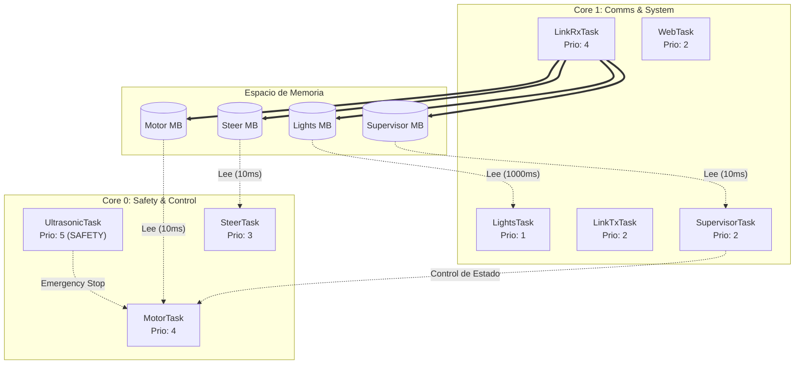

# Documento de Arquitectura de Software (SAD)

**Subsistema:** Vehicle Control Unit (VCU)  
**Plataforma:** ESP32 / FreeRTOS  
**Versión:** 2.0.0  
**Fecha:** Noviembre 2025  

---

## 1. Visión General de la Arquitectura

El sistema implementa una arquitectura de tiempo real basada en muestreo periódico (**Time-Triggered Architecture**). Las tareas de control se ejecutan de manera sincrónica a una frecuencia predeterminada, garantizando un ciclo de ejecución constante y predecible.

Este diseño prioriza la estabilidad del bucle de control y la simplicidad en la depuración, utilizando un modelo de **Mailboxes** para el intercambio seguro de datos entre hilos.

### 1.1 Drivers Arquitectónicos
El diseño actual se fundamenta en los siguientes principios:

* **Determinismo de Ciclo:** Las tareas de actuación (Motor/Dirección) mantienen una cadencia fija de 100Hz (10ms), lo que asegura que el PWM se actualice de forma constante.
* **Seguridad (Safety):** Se implementa un mecanismo de `Time-To-Live` (TTL) que valida la frescura de los datos en cada ciclo de lectura, llevando el vehículo a un estado seguro ante la pérdida de enlace.
* **Separación de Recursos:** Se utiliza *Core Pinning* para aislar el procesamiento de comunicaciones (Core 1) de la ejecución crítica de movimiento (Core 0).

## 2. Estrategia de Comunicación Inter-Procesos (IPC)

La arquitectura utiliza un modelo híbrido: **Polling** para operación nominal y **Notificaciones Directas** para emergencias.

### 2.1 Operación Nominal: Polling con Mailbox
El flujo de datos estándar desacopla la recepción de la ejecución:

1.  **Recepción Asíncrona:** El productor (`LinkRx`) actualiza el `mailbox_t` (protegido por Mutex) inmediatamente al recibir datos por UART.
2.  **Ejecución Sincrónica:** El consumidor (`MotorTask`) utiliza `vTaskDelay` para mantener un periodo de muestreo fijo (10ms). Al despertar, toma la "foto" más reciente del estado del buzón y la aplica.

### 2.2 Mecanismo de Excepción: Fast-Path de Emergencia
Para garantizar la seguridad crítica, el sistema implementa un canal de comunicación de alta prioridad que permite omitir el ciclo de espera periódico y forzar el frenado inmediato.

* **Mecanismo de Acción:**
    1.  **Notificación Directa:** Se utiliza un mecanismo de señalización asíncrono (Event Flags) para enviar una alerta directa a la tarea de control, evitando la cola de espera del *polling*.
    2.  **Despertar Inmediato:** Al recibir esta señal, la Tarea de Motor interrumpe su estado de suspensión (`Sleep`) instantáneamente, sin esperar a que se cumpla el tiempo del ciclo.
    3.  **Prioridad de Ejecución:** La lógica de emergencia se evalúa antes que cualquier comando de movimiento estándar, asegurando una reacción en tiempo real estricto (<1ms).

* **Fuentes de Disparo:**
    * **Sensores Físicos:** Ultrasonido (barrera de proximidad).
    * **Comandos Externos:** Solicitud de parada inmediata vía UART o Web (Botón de Pánico).
    * **Sistema:** Fallos de estado detectados por el Supervisor.

| Característica | Comandos Normales | Emergencia |
| :--- | :--- | :--- |
| **Mecanismo** | `mailbox_write()` | `motor_task_trigger_emergency()` |
| **Activación** | Polling (Timer) | Notificación Directa |
| **Latencia** | Variable (0-10ms) | Inmediata (<1ms) |

### 2.3 Características Operativas (Limitaciones)
* **Previsibilidad vs Latencia:** La carga de la CPU es constante, pero existe un *jitter* inherente en la respuesta a comandos normales.
* **Filtrado Implícito:** Al muestrear a 100Hz, el sistema ignora variaciones de alta frecuencia entre ciclos.

---

## 3. Vista Lógica y Estructura de Datos

### 3.1 Estructura del Mailbox
La estructura de datos es el contrato central entre tareas, diseñada para la integridad y validación temporal.

```c
typedef struct {
    uint32_t ts_ms;          // Timestamp de recepción
    topic_t topic;           // Identificador (Motor, Steer)
    command_type_t cmd;      // Comando
    int32_t value;           // Valor PWM/Ángulo
    uint32_t ttl_ms;         // Vida útil del comando
    SemaphoreHandle_t mutex; // Protección de lectura/escritura
} mailbox_t;
```

### 3.2 Subsistema de Supervisión (`SupervisorTask`)
El `supervisor_mailbox` no gestiona el movimiento del vehículo, sino la **Gestión del Estado del Sistema**.

* **Responsabilidad:** Controlar la Máquina de Estados Global (`DISARMED` → `ARMED` → `RUNNING` → `FAULT`).
* **Fuentes de Comandos:** `link_rx_task` (UART) y `web_task` (HTTP).

| Comando | Acción | Transición Típica |
| :--- | :--- | :--- |
| **CMD_SYS_ARM** | Habilita el sistema y resetea heartbeat. | `DISARMED` → `ARMED` |
| **CMD_SYS_DISARM** | Detiene motor, centra dirección y deshabilita. | `ANY` → `DISARMED` |
| **CMD_SYS_MODE** | Cambia lógica de control (`AUTO` vs `MANUAL`). | Afecta Watchdog |

* **Funciones Adicionales:**
    * **Watchdog/Heartbeat:** En modo `AUTO`, verifica recepción constante de datos. Si falla, desarma el sistema.
    * **E-STOP Hardware:** Monitoreo directo de pin GPIO para parada de emergencia física.
    * **Validación:** Impide que los comandos de motor/dirección se ejecuten si el estado no es `ARMED/RUNNING`.

---

## 4. Diagramas de Arquitectura

### 4.1 Diagrama de Secuencia: Ciclo de Control

```mermaid
sequenceDiagram
    autonumber
    participant UART
    participant Producer as LinkRxTask
    participant Safety as UltrasonicTask
    participant Data as Motor Mailbox
    participant Consumer as MotorTask

    %% CASO 1: COMANDO NORMAL (POLLING)
    Note over Consumer: Estado: BLOCKED (Delay 10ms)
    UART->>Producer: Recibe "SET_SPEED: 200"
    Producer->>Data: Escribe {val: 200}
    
    Note over Consumer: ... Esperando Timer ...
    
    Note over Consumer: Fin vTaskDelay()
    rect rgb(40, 40, 50)
        note right of Consumer: Ciclo Normal
        Consumer->>Data: Lee Mailbox
        Consumer->>Consumer: Actualizar PWM
    end

    %% CASO 2: EMERGENCIA (FAST PATH)
    Note over Consumer: Estado: BLOCKED (Delay 10ms)
    Safety->>Safety: Obstáculo Detectado!
    
    rect rgb(60, 20, 20)
        note right of Safety: Fast Path (<1ms)
        Safety->>Consumer: xTaskNotify(EMERGENCY)
        Note over Consumer: DESPIERTA INMEDIATAMENTE
        Consumer->>Consumer: STOP MOTOR
    end
```



### 4.2 Diagrama de Despliegue



---

## 5. Vista de Procesos y Concurrencia

El sistema utiliza **Multiprocesamiento Asimétrico** sobre los dos núcleos del ESP32. Se ha aislado el **Core 0** para tareas críticas de movimiento y seguridad, mientras que el **Core 1** gestiona la carga variable de comunicaciones e I/O secundario.

### 5.1 Distribución de Carga (Core Affinity)

| Núcleo | Rol | Tareas Asignadas | Prioridad | Descripción |
| :--- | :--- | :--- | :--- | :--- |
| **Core 0** | **Safety & Motion** | `UltrasonicTask` | **Crítica (5)** | **Capa de Seguridad:** Monitoreo de entorno y prevención de colisiones. Máxima prioridad del sistema. |
| **Core 0** | **Real-Time Control** | `MotorTask`, `SteerTask` | Alta (3-4) | Generación de PWM preciso y bucles de control. Aislado de interrupciones de red. |
| **Core 1** | **Comms Ingress** | `LinkRxTask` | Alta (4) | Recepción y decodificación de alta velocidad (UART/WiFi). |
| **Core 1** | **System & I/O** | `WebTask`, `Supervisor`, `LinkTx`, `Lights` | Media/Baja (1-2) | Gestión de pila TCP/IP, telemetría, watchdog y control de iluminación. |

---

## 6. Evolución de la Arquitectura (Roadmap)

La arquitectura actual (v2.0) proporciona una base sólida y estable. Sin embargo, para escenarios de competición o maniobras de alta velocidad que requieren tiempos de reacción en el orden de los microsegundos, se ha planteado una evolución hacia la versión 3.0.

### 6.1 Áreas de Optimización
1.  **Reducción de Latencia:** En el modelo actual, el tiempo de respuesta está acotado por el periodo de muestreo (10ms). Una arquitectura basada en eventos eliminaría esta espera.
2.  **Eficiencia Energética:** La transición a un modelo *Event-Driven* permitiría que el procesador permanezca en estado *Idle* durante los periodos de inactividad, en lugar de despertar periódicamente.

### 6.2 Próxima Iteración (v3.0.0)
La siguiente versión extenderá el patrón "Fast-Path" actual a la operación nominal, transformando el sistema de un modelo híbrido a uno puramente reactivo.
