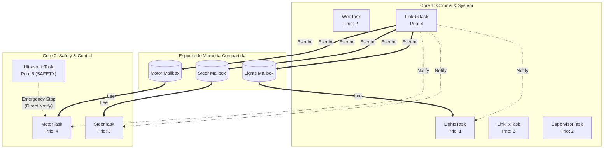

# Documento de Arquitectura de Software
**Proyecto:** Sistema de Control de Vehículo RC (ESP32 / FreeRTOS)  
**Versión:** 3.0.0  
**Fecha:** x  

---

## 1. Visión General de la Arquitectura

El sistema implementa una arquitectura de tiempo real basada en eventos (**Event-Driven Real-Time Architecture**), diseñada específicamente para la plataforma ESP32. El diseño prioriza la baja latencia, el determinismo y la seguridad operativa (Safety) sobre el rendimiento de procesamiento masivo.

La comunicación entre subsistemas se basa en el patrón de diseño **"Shared State with Lightweight Notification"**, una adaptación optimizada del mecanismo de *Mailbox* nativo de FreeRTOS.

### 1.1 Drivers Arquitectónicos

Las decisiones de diseño responden a los siguientes requisitos no funcionales críticos:

* **Determinismo Temporal:** Garantizar una respuesta de actuación `<1ms` desde la recepción de eventos críticos.
* **Eficiencia de CPU:** Minimizar los ciclos de reloj desperdiciados en *polling* (espera activa) mediante un modelo puramente reactivo.
* **Consistencia de Datos (Freshness):** Implementación de semántica *Last-Writer-Wins* para descartar comandos obsoletos en situaciones de congestión.
* **Concurrencia Segura:** Aislamiento de procesos críticos (Motor/Seguridad) de procesos de comunicación (WiFi/UART) mediante *Core Pinning*.

---

## 2. Estrategia de Comunicación Inter-Procesos

Para la comunicación entre tareas, esta arquitectura implementa **Notificaciones Directas (Direct Task Notifications)** en lugar del modelo estándar de Colas (Queues).

### 2.1 Justificación Técnica

De acuerdo con la documentación oficial del Kernel de FreeRTOS, las notificaciones de tareas son una primitiva de sincronización más eficiente que los semáforos binarios y las colas tradicionales:

> *"Task notifications have a lower RAM footprint and execute significantly faster than binary semaphores or queues."* — **FreeRTOS Kernel Documentation** [1]

Dada la restricción de tiempo real, se seleccionó este mecanismo para minimizar el *overhead* del kernel en el cambio de contexto.

### 2.2 Implementación del Patrón Mailbox Extendido

Si bien FreeRTOS define un uso de notificaciones como "Mailbox" para valores de 32 bits [2], este sistema extiende dicho concepto para manejar estructuras de datos complejas.

El patrón se implementa en dos fases atómicas:

1.  **Actualización de Estado (Data Plane):** El productor escribe en una estructura `mailbox_t` protegida por un Mutex. Esto garantiza la integridad de datos compuestos (comando + timestamp + valor).
2.  **Señalización de Evento (Control Plane):** El productor envía una *Task Notification* al consumidor. Esto saca a la tarea de control del estado `Blocked` inmediatamente, sin necesidad de consultar colas intermedias.

---

## 3. Vista Lógica y Estructura de Datos

El sistema sigue el principio de **Composición sobre Herencia**, desacoplando los módulos de hardware mediante interfaces de memoria compartida.

### 3.1 Estructura del Mailbox (`mailbox_t`)

La unidad de intercambio de información se define como:

```c
typedef struct {
    uint32_t ts_ms;          // Timestamp para validación de latencia
    topic_t topic;           // Identificador del subsistema
    command_type_t cmd;      // Instrucción específica
    int32_t value;           // Payload del comando
    uint32_t seq;            // Control de secuencia
    uint32_t ttl_ms;         // Time-to-Live (Mecanismo de Safety)
    SemaphoreHandle_t mutex; // Primitiva de exclusión mutua
} mailbox_t;
```

### 3.2 Mecanismos de Seguridad Integrados

* **Safety Barrier (Ultrasonic):** La tarea de ultrasonido opera con la máxima prioridad del sistema, teniendo la capacidad de anular comandos de motor para prevenir colisiones físicas.
* **Time-to-Live (TTL):** Antes de ejecutar cualquier acción, el consumidor valida: `(now - ts_ms) < ttl_ms`. Si falla, el sistema asume pérdida de enlace y frena.
* **Emergency Fast-Path:** Los comandos de emergencia utilizan un bit específico en la notificación (`xTaskNotify`), permitiendo una reacción inmediata sin procesar la estructura completa.

---

## 4. Diagramas de Arquitectura

### 4.1 Diagrama de Secuencia (Protocolo de Comunicación)

```mermaid
sequenceDiagram
    autonumber
    participant UART as UART
    participant Producer as LinkRxTask
    participant Data as Motor Mailbox
    participant Consumer as MotorTask

    Note over Consumer: Estado: BLOCKED (Dormido)<br/>Esperando xTaskNotify...

    UART->>Producer: Recibe "SET_SPEED: 200"
    
    rect rgb(30, 30, 30)
        note right of Producer: 1. Fase de Escritura (MAILBOX)
        Producer->>Data: Escribe {cmd, val, timestamp}
    end

    rect rgb(50, 50, 50)
        note right of Producer: 2. Fase de Evento (NOTIFICATION)
        Producer->>Consumer: xTaskNotify()
    end

    Note over Consumer: ¡DESPIERTA! (<1ms)

    rect rgb(30, 30, 30)
        note right of Consumer: 3. Fase de Lectura y Ejecución
        Consumer->>Data: Lee copia local
        
        alt TTL Válido
            Consumer->>Consumer: Aplica PWM Motor
        else TTL Expirado
            Consumer->>Consumer: Freno de Emergencia
        end
    end
    
    Note over Consumer: Vuelve a Dormir
```



### 4.2 Diagrama de Despliegue (Multicore)

Este diagrama refleja la distribución física de tareas según la inicialización del sistema.



---

## 5. Vista de Procesos y Concurrencia

El sistema utiliza **Multiprocesamiento Asimétrico** sobre los dos núcleos del ESP32. Se ha aislado el **Core 0** para tareas críticas de movimiento y seguridad, mientras que el **Core 1** gestiona la carga variable de comunicaciones e I/O secundario.

### 5.1 Distribución de Carga (Core Affinity)

| Núcleo | Rol | Tareas Asignadas | Prioridad | Descripción |
| :--- | :--- | :--- | :--- | :--- |
| **Core 0** | **Safety & Motion** | `UltrasonicTask` | **Crítica (5)** | **Capa de Seguridad:** Monitoreo de entorno y prevención de colisiones. Máxima prioridad del sistema. |
| **Core 0** | **Real-Time Control** | `MotorTask`, `SteerTask` | Alta (3-4) | Generación de PWM preciso y bucles de control. Aislado de interrupciones de red. |
| **Core 1** | **Comms Ingress** | `LinkRxTask` | Alta (4) | Recepción y decodificación de alta velocidad (UART/WiFi). |
| **Core 1** | **System & I/O** | `WebTask`, `Supervisor`, `LinkTx`, `Lights` | Media/Baja (1-2) | Gestión de pila TCP/IP, telemetría, watchdog y control de iluminación. |

---

## 6. Referencias y Normativa

Para garantizar la adherencia a las mejores prácticas de la industria y la correcta utilización del RTOS, esta arquitectura se basa en las siguientes especificaciones oficiales:

1.  **FreeRTOS Kernel Features - Task Notifications.** Describe las ventajas de rendimiento y memoria de las notificaciones sobre los objetos tradicionales de IPC.  
    *Fuente:* [https://freertos.org/Documentation/02-Kernel/02-Kernel-features/03-Direct-to-task-notifications/01-Task-notifications](https://freertos.org/Documentation/02-Kernel/02-Kernel-features/03-Direct-to-task-notifications/01-Task-notifications)

2.  **FreeRTOS Kernel Features - Task Notifications Used As Mailbox.** Define el patrón conceptual de sobrescritura de valores (*overwrite*) utilizado para la lógica "Last-Writer-Wins".  
    *Fuente:* [https://freertos.org/Documentation/02-Kernel/02-Kernel-features/03-Direct-to-task-notifications/05-As-mailbox](https://freertos.org/Documentation/02-Kernel/02-Kernel-features/03-Direct-to-task-notifications/05-As-mailbox)
